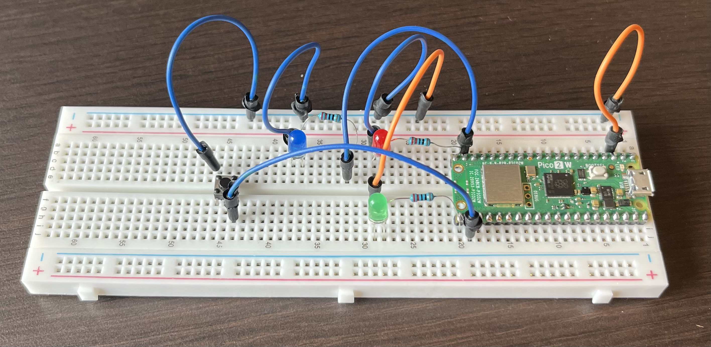

# Raspberry Pi Pico Traffic Light

## Features
- Traffic light operation
- Pedestrian crossing button
- Interrupt-based button detection

## Hardware
- Raspberry Pi Pico 2 W
- 3 LEDs
- 220Ω resistors
- Pushbutton

## Future Improvements
- Walk signal
- Countdown timer
- Night mode

